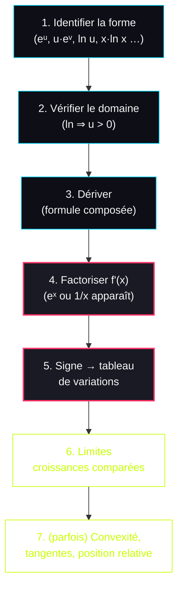
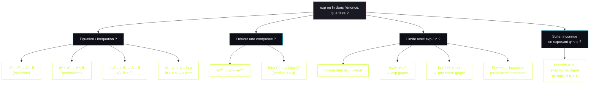

# 📈 Fiche de Combat — Fonction Exponentielle & Logarithme Népérien

> **Bac blanc — Terminale Maths Spé**
> Les deux fonctions traitées ensemble parce qu'elles sont **réciproques** : tout ce qu'on apprend sur l'une se transpose sur l'autre par symétrie.

---

## ⚡ Carte des réflexes

| Tu vois ça dans l'énoncé... | Tu déclenches... |
|---|---|
| Équation $e^A = e^B$ | $A = B$ (exp injective) |
| Équation $\ln A = \ln B$ avec A,B>0 | $A = B$ (ln injective) |
| Inéquation $e^A < e^B$ | $A < B$ (exp strictement croissante) |
| Inéquation $\ln A < \ln B$ avec A,B>0 | $A < B$ (ln strictement croissante) |
| $e^x = a$ avec $a > 0$ | $x = \ln a$ |
| $\ln x = a$ avec $x > 0$ | $x = e^a$ |
| Forme $e^{u(x)}$ à dériver | $u'(x) \cdot e^{u(x)}$ |
| Forme $\ln(u(x))$ à dériver | $\dfrac{u'(x)}{u(x)}$ (avec u > 0) |
| Limite de type $\dfrac{e^x}{x^n}$ ou $x^n e^{-x}$ | Croissances comparées (exp gagne) |
| Limite de type $\dfrac{\ln x}{x^n}$ ou $x \ln x$ | Croissances comparées (puissance gagne) |
| FI quand on a $\ln$ ou $e$ | Souvent factoriser par le terme dominant |

---

## I. Fonction exponentielle : définition et propriétés

### 1. Définition (la base à retenir mot pour mot)

**Théorème admis :** Il existe une **unique** fonction f définie et dérivable sur ℝ telle que :
$$f(0) = 1 \quad \text{et} \quad f' = f$$

Cette fonction est appelée **fonction exponentielle**, notée `exp`.

**Conséquences immédiates (à savoir réciter) :**
- $\exp(x)$ existe pour tout réel x → **domaine = ℝ**
- $\exp(0) = 1$
- $(\exp)' = \exp$ (elle est égale à sa dérivée)
- $\exp(x) > 0$ pour tout x ∈ ℝ ⚠️ TOUJOURS POSITIVE

⚠️ **Piège classique :** ne JAMAIS écrire $e^x = 0$ ou $e^x \leq 0$. C'est faux. L'exponentielle est **strictement positive**, point. Ça simplifie souvent les études de signe (par exemple, dans `f'(x) = e^x · g(x)`, le signe de f' = signe de g).

### 2. Propriétés algébriques (à connaître par cœur)

Pour tous réels a, b et tout entier n :

| Propriété | Formule |
|---|---|
| Produit | $e^{a+b} = e^a \times e^b$ |
| Inverse | $e^{-a} = \dfrac{1}{e^a}$ |
| Quotient | $e^{a-b} = \dfrac{e^a}{e^b}$ |
| Puissance | $(e^a)^n = e^{na}$ |
| Racine | $\sqrt{e} = e^{1/2}$, et plus généralement $\sqrt{e^a} = e^{a/2}$ |

**Le mémo du cours :** "Cette nouvelle notation $e^x$ permet d'appliquer les mêmes règles de calcul qu'avec les puissances." → Si tu connais tes règles sur $a^n \times a^m$, tu connais déjà tout.

### 3. Le nombre e

**Définition :** $e = \exp(1)$, appelé **nombre de Néper**.
- $e \approx 2{,}72$
- C'est juste un nombre réel comme π. La notation $e^x$ vient du fait que $\exp(x) = (e)^x$ par cohérence avec les puissances.

### 4. Exemples de calculs (type DS)

$$e^3 \times e^4 = e^{3+4} = e^7$$

$$(e^{1{,}5})^3 = e^{1{,}5 \times 3} = e^{4{,}5}$$

$$e^{-2} = \dfrac{1}{e^2}$$

$$\dfrac{(e^7)^4 \times e^3}{e^4} = \dfrac{e^{28} \times e^3}{e^4} = \dfrac{e^{31}}{e^4} = e^{27}$$

$$(e^x)^2 \times e^{3+x} = e^{2x} \times e^{3+x} = e^{3x+3}$$

### 5. Étude de la fonction (variations + limites)

**Stricte croissance :** comme $(e^x)' = e^x > 0$, la fonction exponentielle est **strictement croissante sur ℝ**.

**Conséquences (équations et inéquations) :**
$$e^a = e^b \iff a = b \quad \text{(exp est injective)}$$
$$e^a < e^b \iff a < b \quad \text{(stricte croissance)}$$

**Exemple d'inéquation (ton cours) :**
$$e^{3x+1} < e^{x-2} \iff 3x + 1 < x - 2 \iff 2x < -3 \iff x < -\dfrac{3}{2}$$
Donc $S = \left]-\infty\,;\,-\dfrac{3}{2}\right[$.

**Limites :**
$$\lim_{x \to +\infty} e^x = +\infty \quad \text{et} \quad \lim_{x \to -\infty} e^x = 0$$

**Tableau de variation :**

| x | $-\infty$ | | $+\infty$ |
|---|---|---|---|
| $(e^x)' = e^x$ | | + | |
| $e^x$ | 0 | ↗ | $+\infty$ |

### 6. Dérivée de $e^{u(x)}$ (très important)

**Formule générale (cas affine de ton cours) :** si $u(x) = ax + b$, alors :
$$\left(e^{ax+b}\right)' = a \times e^{ax+b}$$

**Cas général (à savoir aussi) :** pour u dérivable,
$$\left(e^{u(x)}\right)' = u'(x) \times e^{u(x)}$$

**Exemples du cours :**
- $f(x) = e^{3x-2}$ → $f'(x) = 3 e^{3x-2}$
- $f(x) = x^2 + e^{-x+2}$ → $f'(x) = 2x - e^{-x+2}$ (le `-` vient du fait que $u'(x) = -1$)
- $f(x) = 3e^x + 2x^2$ → $f'(x) = 3e^x + 4x$

**Conséquence sur les variations** (cas affine) :
- Si **a > 0** → $f(x) = e^{ax+b}$ est strictement **croissante** sur ℝ
- Si **a < 0** → $f(x) = e^{ax+b}$ est strictement **décroissante** sur ℝ

(Logique : la dérivée $a \cdot e^{ax+b}$ a le signe de a, puisque $e^{ax+b} > 0$ toujours.)

### 7. Représentation graphique de $e^x$

**Allure à connaître :** courbe strictement croissante, passant par (0, 1) et (1, e). Tangente horizontale "au moins" en $-\infty$ (asymptote y=0).

**Tangentes remarquables :**
- **Au point d'abscisse 0** : pente = $e^0 = 1$, donc $y = 1 \cdot (x - 0) + 1 = x + 1$
- **Au point d'abscisse 1** : pente = $e^1 = e$, donc $y = e(x - 1) + e = ex$

⚠️ Ces deux tangentes sont des **classiques bac**. La tangente $y = x+1$ en 0 sert souvent à prouver l'inégalité $e^x \geq x + 1$.

---

## II. Fonction logarithme népérien : définition et propriétés

### 1. Définition (par réciprocité)

L'exponentielle est continue et strictement croissante sur ℝ, avec $\lim e^x = 0$ en $-\infty$ et $\lim e^x = +\infty$ en $+\infty$.

→ Par théorème des valeurs intermédiaires, pour tout $a > 0$, l'équation $e^x = a$ admet une **unique solution**.

**Définition :** la fonction **logarithme népérien**, notée **ln**, est la fonction réciproque de exp, définie sur $]0\,;\,+\infty[$.

$$\boxed{y = \ln(x) \text{ et } x > 0 \iff e^y = x}$$

### 2. Propriétés fondamentales (les "boucles" à connaître)

**Pour tout réel x :**
$$\ln(e^x) = x$$

**Pour tout réel x > 0 :**
$$e^{\ln(x)} = x$$

🎯 **Ces deux égalités sont LE truc qui débloque toutes les équations mélangeant exp et ln.** Si tu vois $e^{\ln(\dots)}$ ou $\ln(e^{\dots})$, tu peux simplifier direct.

### 3. Valeurs particulières

- $\ln 1 = 0$ (car $e^0 = 1$)
- $\ln e = 1$ (car $e^1 = e$)

**Tableau de valeurs (à mémoriser) :**

| x | $e^{-1}$ | 1 | 2 | e | $e^3$ |
|---|---|---|---|---|---|
| $\ln x$ | -1 | 0 | $\ln 2$ | 1 | 3 |

### 4. Résolution des équations type bac

**Pour tout réel a :**
$$\ln(x) = a \iff x = e^a \quad \text{(solution unique)}$$

**Pour tout réel a > 0 :**
$$e^x = a \iff x = \ln(a) \quad \text{(solution unique)}$$

**Exemples :**
- $\ln x = 3$ → $x = e^3$
- $e^x = 5$ → $x = \ln 5$
- $\ln x = -2$ → $x = e^{-2} = 1/e^2$

### 5. Symétrie graphique

**Propriété :** dans un repère orthonormé, les courbes de exp et ln sont **symétriques par rapport à la droite y = x**.

```plot
{
  "title": "Symétrie exp / ln par rapport à y = x",
  "fns": [
    { "fn": "exp(x)", "color": "#ff3366" },
    { "fn": "log(x)", "color": "#00d9ff", "range": [0.01, 5] },
    { "fn": "x", "color": "#a1a1aa" }
  ],
  "xDomain": [-3, 5],
  "yDomain": [-3, 5],
  "points": [[0, 1], [1, 0], [1, 2.71828], [2.71828, 1]],
  "height": 360
}
```

→ Conséquence : tout ce que tu sais sur exp se transpose en "miroir" sur ln (limites, croissance, valeurs particulières).

### 6. Propriétés algébriques (le **cœur** des exos)

Pour tous réels **strictement positifs** a et b, et tout entier n :

| Propriété | Formule |
|---|---|
| Produit | $\ln(ab) = \ln a + \ln b$ |
| Quotient | $\ln\left(\dfrac{a}{b}\right) = \ln a - \ln b$ |
| Inverse | $\ln\left(\dfrac{1}{a}\right) = -\ln a$ |
| Puissance | $\ln(a^n) = n \ln a$ |
| Racine | $\ln(\sqrt{a}) = \dfrac{1}{2} \ln a$ |

⚠️ **Piège majeur :** le ln transforme les **produits en sommes** (et inversement). C'est l'inverse de l'exp qui transforme les sommes en produits. Ne pas confondre.

⚠️ **Le ln n'a PAS de propriété pour ln(a+b) ou ln(a-b).** Aucune simplification possible. Si tu vois $\ln(a + b)$ dans un calcul, tu ne peux PAS le casser.

### 7. Exemples chiffrés (type bac)

**Exemple 1 :** $\ln 10 = \ln(2 \times 5) = \ln 2 + \ln 5$.

**Exemple 2 :** Pour $x > 1$ : $\ln(x-1) + \ln(x+1) = \ln((x-1)(x+1)) = \ln(x^2 - 1)$.

**Exemple 3 (exprimer en fonction de ln 2 et ln 3) :**

$\ln \dfrac{1}{18}$ :
$$\ln\dfrac{1}{18} = \ln 1 - \ln 18 = -\ln(2 \times 3^2) = -\ln 2 - 2\ln 3$$

$\ln 72$ :
$$\ln 72 = \ln(2^3 \times 3^2) = 3\ln 2 + 2\ln 3$$

$\ln \dfrac{2 e^3}{3}$ :
$$\ln \dfrac{2e^3}{3} = \ln(2e^3) - \ln 3 = \ln 2 + \ln e^3 - \ln 3 = \ln 2 + 3 - \ln 3$$

**Exemple 4 (résoudre une inéquation à inconnue en exposant) :**

Résoudre $0{,}85^n < 0{,}6$ :
$$0{,}85^n < 0{,}6 \iff \ln(0{,}85^n) < \ln(0{,}6) \iff n \ln 0{,}85 < \ln 0{,}6$$

⚠️ **Piège :** $\ln 0{,}85 < 0$ (car $0{,}85 < 1$). Donc en divisant par $\ln 0{,}85$, on **change le sens de l'inégalité** :
$$n > \dfrac{\ln 0{,}6}{\ln 0{,}85} \approx 3{,}14$$

Donc le plus petit entier solution est **n = 4**.

🎯 **C'est l'usage typique du ln pour les suites :** quand l'inconnue est en exposant, on prend le ln pour la "faire descendre".

### 8. Étude de la fonction ln

**Domaine :** $]0\,;\,+\infty[$ (le ln n'existe pas pour x ≤ 0).

**Limites :**
$$\lim_{x \to 0^+} \ln x = -\infty \quad \text{et} \quad \lim_{x \to +\infty} \ln x = +\infty$$

**Dérivée :** ln est dérivable sur $]0\,;\,+\infty[$ et :
$$(\ln x)' = \dfrac{1}{x}$$

**Tableau de variation :**

| x | 0 | | $+\infty$ |
|---|---|---|---|
| $(\ln x)' = 1/x$ | | + | |
| $\ln x$ | $-\infty$ | ↗ | $+\infty$ |

→ ln est **strictement croissante** sur $]0\,;\,+\infty[$.

**Conséquences (équations / inéquations) :**

Pour tous réels a, b **strictement positifs** :
$$\ln a = \ln b \iff a = b$$
$$\ln a < \ln b \iff a < b$$

**Signe de ln :**

| x | 0 | | 1 | | $+\infty$ |
|---|---|---|---|---|---|
| $\ln x$ | | – | 0 | + | |

À retenir : $\ln x < 0$ pour $0 < x < 1$, et $\ln x > 0$ pour $x > 1$.

### 9. Tangentes remarquables à $y = \ln x$

**Au point d'abscisse 1 :** pente = $\ln'(1) = 1$, et $\ln 1 = 0$.
$$y = 1 \cdot (x - 1) + 0 = x - 1$$
→ Tangente : $\boxed{y = x - 1}$. Donne l'inégalité utile $\ln x \leq x - 1$ pour x > 0.

**Au point d'abscisse e :** pente = $\ln'(e) = 1/e$, et $\ln e = 1$.
$$y = \dfrac{1}{e}(x - e) + 1 = \dfrac{x}{e} - 1 + 1 = \dfrac{x}{e}$$
→ Tangente : $\boxed{y = \dfrac{x}{e} = x \cdot e^{-1}}$.

### 10. Dérivée de $\ln(u(x))$ (ultra important pour les exos)

Si **u est dérivable et strictement positive** sur un intervalle I, alors $\ln(u)$ est dérivable sur I et :
$$\boxed{\left(\ln(u(x))\right)' = \dfrac{u'(x)}{u(x)}}$$

⚠️ **Condition impérative :** $u(x) > 0$ sur I, sinon le ln n'est pas défini.

**Exemples :**
- $f(x) = \ln(x^2 + 1)$ → $u = x^2 + 1 > 0$ toujours, $u' = 2x$, donc $f'(x) = \dfrac{2x}{x^2+1}$.
- $f(x) = \ln(3x - 5)$ → définie pour $x > 5/3$, $f'(x) = \dfrac{3}{3x-5}$.

---

## III. Croissances comparées (très important pour les limites)

### 1. Les 4 limites à connaître par cœur

**Côté exponentielle (l'exp écrase tout) :**
$$\lim_{x \to +\infty} \dfrac{e^x}{x^n} = +\infty \quad (\text{pour tout } n \in \mathbb{N})$$
$$\lim_{x \to -\infty} x^n e^x = 0 \quad (\text{ou } \lim_{x \to +\infty} x^n e^{-x} = 0)$$

**Côté logarithme (la puissance écrase le ln) :**
$$\lim_{x \to +\infty} \dfrac{\ln x}{x^n} = 0 \quad (\text{pour tout } n \in \mathbb{N}^*)$$
$$\lim_{x \to 0^+} x^n \ln x = 0 \quad (\text{pour tout } n \in \mathbb{N}^*)$$

### 2. La hiérarchie à mémoriser

> **En +∞ : exp >> puissances >> ln**
> "L'exponentielle écrase les puissances qui écrasent le logarithme."

Donc dans un quotient ou un produit en $+\infty$, c'est toujours **l'exp qui gagne** face à une puissance, et la **puissance qui gagne** face au ln.

### 3. Limite remarquable au voisinage de 1

$$\lim_{x \to 0} \dfrac{\ln(x+1)}{x} = 1 \quad \text{ou de façon équivalente} \quad \lim_{x \to 1} \dfrac{\ln x}{x - 1} = 1$$

**Interprétation :** c'est la **définition du nombre dérivé de ln en 1** (rappel : $\ln'(1) = 1$).

---

## IV. Tableau de synthèse : exp vs ln (par symétrie)

| Propriété | Exponentielle $e^x$ | Logarithme $\ln x$ |
|---|---|---|
| Domaine | $\mathbb{R}$ | $]0\,;\,+\infty[$ |
| Image | $]0\,;\,+\infty[$ | $\mathbb{R}$ |
| Valeur en 0 | $e^0 = 1$ | $\ln 0$ : **non défini** (lim = -∞) |
| Valeur en 1 | $e^1 = e$ | $\ln 1 = 0$ |
| Dérivée | $(e^x)' = e^x$ | $(\ln x)' = 1/x$ |
| Variation | strictement croissante sur ℝ | strictement croissante sur $]0;+\infty[$ |
| Signe | $e^x > 0$ toujours | négatif sur ]0;1[, positif sur ]1;+∞[ |
| Limite en $-\infty$ ou $0^+$ | $\lim_{-\infty} e^x = 0$ | $\lim_{0^+} \ln x = -\infty$ |
| Limite en $+\infty$ | $\lim_{+\infty} e^x = +\infty$ | $\lim_{+\infty} \ln x = +\infty$ |
| Tangente en 1ère valeur clé | $y = x + 1$ (en 0) | $y = x - 1$ (en 1) |
| Relation produit | $e^{a+b} = e^a e^b$ | $\ln(ab) = \ln a + \ln b$ |
| Croissance comparée | exp écrase les puissances | les puissances écrasent ln |

🎯 **Mnémo :** "Exp transforme les sommes en produits, ln transforme les produits en sommes." Les deux fonctions sont des "ponts" entre ces opérations.

---

## V. Exercices types bac : reconnaître la stratégie

### Type 1 : équation/inéquation avec $e$ ou $\ln$
**Méthode :** appliquer ln (ou exp) des deux côtés, puis utiliser l'injectivité.
- $e^A = e^B \iff A = B$
- $\ln A = \ln B \iff A = B$ (avec A, B > 0)

### Type 2 : étude d'une fonction $f(x) = e^{u(x)}$ ou $\ln(u(x))$
**Méthode :**
1. Domaine de définition (pour ln : il faut $u > 0$).
2. Dérivée : $u' \cdot e^{u}$ ou $u'/u$.
3. Signe de la dérivée = signe de $u'$ (car $e^u > 0$ et $u > 0$ pour ln).
4. Tableau de variations + limites.

### Type 3 : limite avec FI (forme indéterminée)
**Méthode :**
- Si on a $\dfrac{e^x}{\dots}$ ou $\dfrac{\dots}{\ln x}$ → croissances comparées.
- Si FI de type $\infty - \infty$ avec exp et polynôme → factoriser par l'exp ($e^x$ domine).
- Si FI avec $\ln$ et polynôme → factoriser par la puissance dominante.

**Exemple :** $\lim_{x \to +\infty} (x - \ln x)$.
$$x - \ln x = x\left(1 - \dfrac{\ln x}{x}\right)$$
Or $\lim \ln x / x = 0$, donc le facteur entre parenthèses tend vers 1, et $\lim x = +\infty$, donc $\lim (x - \ln x) = +\infty$.

### Type 4 : suites — passer en log pour résoudre $q^n < c$
**Méthode :**
1. Prendre le ln des deux côtés : $n \ln q < \ln c$.
2. Diviser par $\ln q$ en faisant ATTENTION au signe (si $0 < q < 1$, alors $\ln q < 0$ → on inverse l'inégalité).
3. Conclure avec le plus petit/grand entier.

---

## VI. Anatomie d'un exo bac type "Exp/Ln" (sessions 2024-2025)

🎯 **Pattern récurrent confirmé** : exp et ln apparaissent **dans toutes les études de fonctions du bac**. Voir aussi fiche limites/continuité §VI pour la structure générale d'un exo "étude de fonction".

### Forme 1 : Étude de fonction avec exp ou ln (LE pattern roi)

🎯 **Pattern observé sur** : Métropole 2024 J1, J2, 2025 J1 (étude $f$ avec $\ln$), 2025 J2 (Vrai/Faux avec exp/ln), septembre 2025 (glycémie avec $te^{-0{,}4t}$), Amérique du Nord 2025 J1 (analyse 3 parties).

**Structure type** :

```mermaid
flowchart TD
  PA["Partie A<br/>Lecture graphique"]
  PA --> PA1["Valeurs particulières<br/>f(0), tangente"]
  PA --> PA2["Sens de variation<br/>(conjecture)"]
  PA --> PA3["Équation d'une tangente"]

  PB["Partie B<br/>Étude analytique"]
  PB --> Q1["Q1. Limites<br/>(croissances comparées)"]
  PB --> Q2["Q2. f'(x)<br/>(dérivée composée)"]
  PB --> Q3["Q3. Signe de f'<br/>tableau de variations"]
  PB --> Q4["Q4. Convexité<br/>(signe de f'')"]
  PB --> Q5["Q5. Tangentes<br/>remarquables"]
  PB --> Q6["Q6. Position relative<br/>𝒞_f vs tangente"]
  PB --> Q7["Q7. Intégrale / aire<br/>(cf. fiche intégration)"]

  PC["Partie C (parfois)<br/>Suite u_{n+1} = f(u_n)"]

  classDef part fill:#1a1a24,stroke:#ff3366,stroke-width:2px,color:#f5f5f7;
  classDef step fill:#0e0e16,stroke:#00d9ff,color:#f5f5f7;
  classDef leaf fill:transparent,stroke:#c8ff00,color:#c8ff00;
  class PA,PB,PC part;
  class PA1,PA2,PA3,Q5,Q6,Q7 leaf;
  class Q1,Q2,Q3,Q4 step;
```



### Forme 2 : Équations et inéquations avec exp/ln

**Pattern observé** : on demande de résoudre $e^{ax + b} = k$ ou $\ln(ax + b) = k$.

### Forme 3 : QCM Vrai/Faux avec exp/ln (Métropole 2025 J2)

🎯 **Pattern récent** : 4-5 affirmations à justifier, dont au moins une sur exp ou ln.

### Les 7 questions-types qui reviennent à TOUS les bacs

#### Q1 — "Résoudre l'équation $e^{ax+b} = k$ ou $\ln(ax+b) = k$"

**Méthode (exp)** :
$$e^{ax+b} = k \iff ax + b = \ln k \iff x = \dfrac{\ln k - b}{a} \quad (k > 0)$$

**Méthode (ln)** :
$$\ln(ax+b) = k \iff ax + b = e^k \iff x = \dfrac{e^k - b}{a}$$

⚠️ **Ne pas oublier le domaine** : pour $\ln$, vérifier $ax + b > 0$.

#### Q2 — "Dériver $e^{u(x)}$ ou $\ln(u(x))$"

🎯 **Formules à connaître** :
- $(e^{u(x)})' = u'(x) \cdot e^{u(x)}$
- $(\ln(u(x)))' = \dfrac{u'(x)}{u(x)}$ (avec $u(x) > 0$)

**Exemple bac** : $f(x) = (x^2 + 1) e^{-x}$.
$f'(x) = 2x \cdot e^{-x} + (x^2 + 1) \cdot (-e^{-x}) = e^{-x}(2x - x^2 - 1) = -e^{-x}(x-1)^2$

#### Q3 — "Calculer une limite avec exp ou ln (croissances comparées)"

🎯 **Formules CLÉS à mémoriser** :

**En $+\infty$** :
- $\lim\limits_{x \to +\infty} \dfrac{e^x}{x^n} = +\infty$ ($e^x$ écrase tout polynôme)
- $\lim\limits_{x \to +\infty} \dfrac{\ln x}{x^n} = 0$ ($x^n$ écrase $\ln$)
- $\lim\limits_{x \to +\infty} \dfrac{x^n}{e^x} = 0$
- $\lim\limits_{x \to +\infty} x^n e^{-x} = 0$ (pour $n \geq 0$)

**En $-\infty$** :
- $\lim\limits_{x \to -\infty} x^n e^x = 0$ (pour $n \geq 0$, "$e^{-\infty} = 0$ écrase tout")

**En $0^+$** :
- $\lim\limits_{x \to 0^+} x \ln x = 0$
- $\lim\limits_{x \to 0^+} x^n \ln x = 0$ (pour $n \geq 1$)
- $\lim\limits_{x \to 0^+} \ln x = -\infty$

**Astuce mnémonique** : "L'exponentielle gagne toujours contre la puissance. La puissance gagne toujours contre le logarithme."

#### Q4 — "Étudier le sens de variation"

**Méthode** :
1. Calculer $f'(x)$.
2. Étudier le signe de $f'(x)$ (factoriser !).
3. Dresser le tableau de variations.
4. Indiquer les valeurs aux extrémités (limites).

🎯 **Astuce** : pour les fonctions avec $e^x$, on peut souvent factoriser $f'(x) = e^x \cdot Q(x)$ où $Q(x)$ est un polynôme. Comme $e^x > 0$, le signe de $f'$ est celui de $Q$.

#### Q5 — "Tangentes remarquables"

**Tangentes au point $a$** :
$$y = f'(a)(x - a) + f(a)$$

**Cas particuliers à connaître** :
- Tangente en $0$ à $e^x$ : $y = x + 1$.
- Tangente en $1$ à $\ln x$ : $y = x - 1$.

#### Q6 — "Étudier la convexité"

**Méthode** : signe de $f''(x)$.
- $f'' \geq 0$ → $f$ convexe (forme $\smile$).
- $f'' \leq 0$ → $f$ concave (forme $\frown$).
- $f''$ change de signe → **point d'inflexion**.

🎯 **Astuce exp** : $e^x$ est **convexe sur $\mathbb{R}$** (sa dérivée seconde $e^x > 0$).

🎯 **Astuce ln** : $\ln$ est **concave sur $]0, +\infty[$** (sa dérivée seconde $-1/x^2 < 0$).

#### Q7 — "Position relative entre $\mathcal{C}_f$ et une tangente / une autre courbe"

**Méthode** :
1. Définir $g(x) = f(x) - \text{(autre courbe)}$.
2. Étudier le signe de $g(x)$.
3. Conclure : si $g \geq 0$, $\mathcal{C}_f$ au-dessus.

🎯 **Astuce convexité** : si $f$ est convexe, $\mathcal{C}_f$ est **au-dessus** de toutes ses tangentes.

### Sujets analysés (pour ta culture)

| Sujet | Type | Exp/Ln |
|---|---|---|
| **Métropole 2024 J1** | Étude $f(x) = 5xe^{-x}$ | Exp avec produit, dérivée composée |
| **Métropole 2024 J2** | Étude $f$ + ED | Logarithme + exponentielle |
| **Métropole 2025 J1** | Étude $f$ avec $\ln$ + IPP | $\ln$, croissances comparées |
| **Métropole 2025 J2** | Vrai/Faux + étude fonction | Exp + ln + convexité |
| **Métropole sept 2025** | Glycémie $f(t) = te^{-0{,}4t}$ | Exp + dérivée produit + valeur moyenne |
| **AmN 2025 J1** | Analyse 3 parties | Exp + ED + intégrale |

🎯 **Tu as 100% de chance d'avoir une fonction avec exp ou ln à ton bac blanc**. C'est LE chapitre central des études de fonctions.

### Schéma récap — le combo gagnant exp/ln



---

## VII. Diagramme de décision



---

## VIII. Check-list de relecture

- [ ] Pour toute fonction $\ln(u(x))$, j'ai vérifié que $u > 0$ sur l'intervalle d'étude.
- [ ] Pour les inéquations $e^A < e^B$, j'ai bien utilisé la stricte croissance de exp.
- [ ] Pour les inéquations $\ln A < \ln B$, j'ai vérifié que A et B sont **strictement positifs** AVANT d'enlever le ln.
- [ ] Quand j'ai divisé par $\ln q$ avec $0 < q < 1$, j'ai pensé à **inverser** l'inégalité (car $\ln q < 0$).
- [ ] Pour les croissances comparées, j'ai bien identifié qui domine (exp >> puissance >> ln).
- [ ] Je n'ai PAS écrit $\ln(a + b) = \ln a + \ln b$ (ça n'existe pas — uniquement pour le produit).
- [ ] Je n'ai PAS écrit $e^{a+b} = e^a + e^b$ (ça n'existe pas non plus — c'est un produit).
- [ ] Pour calculer $f'$ avec $e^{u}$ ou $\ln(u)$, j'ai bien dérivé u séparément AVANT.

---

## IX. Anti-sèche : les pièges classiques du correcteur

1. **Confusion produit/somme :**
   - $e^{a+b} = e^a \times e^b$ (somme → produit)
   - $\ln(ab) = \ln a + \ln b$ (produit → somme)
   - **Inverser ces deux fait perdre toute crédibilité de copie.**

2. **Domaine du ln oublié :** quand on étudie $f(x) = \ln(g(x))$, on DOIT chercher où $g(x) > 0$ avant tout. Erreur classique : étudier f sur ℝ alors que le domaine est restreint.

3. **Ln d'un nombre négatif :** $\ln(-2)$, ça **n'existe pas**. Si tu obtiens ça dans un calcul, t'as fait une erreur en amont.

4. **$\ln 1 = 0$ et pas 1.** Bête mais ça arrive.

5. **Dériver $e^{x^2}$ :** beaucoup oublient le facteur 2x. C'est $2x \cdot e^{x^2}$, pas $e^{x^2}$.

6. **Inéquation avec ln d'un nombre < 1 :** quand tu divises par $\ln(0{,}85)$ par exemple, **change de sens** parce que $\ln(0{,}85) < 0$.

7. **Limite mal calculée par "intuition" :** on n'écrit JAMAIS "$\ln(+\infty) = +\infty$" comme un calcul direct. On dit "comme $u(x) \to +\infty$ et $\lim_{X \to +\infty} \ln X = +\infty$, par composition, $\lim \ln(u(x)) = +\infty$".

8. **Tangente $y = x + 1$ vs $y = x - 1$** : la première est en 0 pour exp, la seconde en 1 pour ln. **C'est symétrique, pas identique.** Si tu confonds, tu donnes la mauvaise tangente.

---

