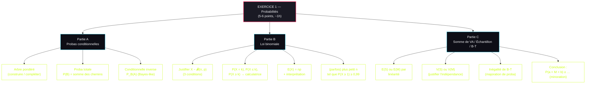
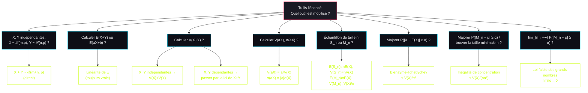

# 🎲 Fiche de Combat — Sommes de VA, Échantillons, Bienaymé-Tchebychev, LGN

> **Bac blanc — Terminale Maths Spé**
> Suite directe de la fiche probas/binomiale. Couvre tout ce qui s'enchaîne après : combinaisons linéaires de VA, échantillons, inégalité de B-T, loi faible des grands nombres.

---

## ⚡ Carte des réflexes

| Tu vois ça dans l'énoncé... | Tu déclenches... |
|---|---|
| « $X_1 \sim \mathcal{B}(m,p)$ et $X_2 \sim \mathcal{B}(n,p)$ indépendantes » | $X_1 + X_2 \sim \mathcal{B}(m+n, p)$ direct (§II.3) |
| « Calculer $E(X+Y)$ » | Linéarité : $E(X+Y) = E(X) + E(Y)$ — TOUJOURS vrai (§III.1) |
| « Calculer $V(X+Y)$ » | $V(X+Y) = V(X) + V(Y)$ — UNIQUEMENT si X et Y indépendantes (§III.3) |
| « Échantillon de taille $n$ », « somme $S_n$ », « moyenne $M_n$ » | Formules §IV : $E(S_n) = nE(X)$, $V(M_n) = V(X)/n$ |
| « Majorer $P(\|X - E(X)\| \geq \alpha)$ » ou « probabilité d'un écart à l'espérance » | **Bienaymé-Tchebychev** (§V.1) |
| « Majorer $P(\|M_n - \mu\| \geq \alpha)$ » ou « pour quelle taille $n$ d'échantillon... » | **Inégalité de concentration** (§V.2) |
| « Quand $n \to +\infty$ » avec $M_n$ | Loi faible des grands nombres (§V.3) |
| « Loi binomiale », $E(X)$ ou $V(X)$ | $E = np$, $V = np(1-p)$, $\sigma = \sqrt{np(1-p)}$ (§II.4) |

---

## I. Loi de couple et indépendance

### 1. Définition de la loi du couple $(X, Y)$

Pour deux variables aléatoires $X$ et $Y$, la **loi du couple** $(X\,;\,Y)$ est définie pour tous nombres réels $k$ et $l$ par :
$$P(X = k\,;\,Y = l) = P(\{X = k\} \cap \{Y = l\})$$

### 2. Indépendance de deux variables aléatoires

**Définition :** $X$ et $Y$ sont **indépendantes** si pour tous réels $k$ et $l$, les événements $\{X = k\}$ et $\{Y = l\}$ sont indépendants.

**Propriété (à utiliser systématiquement) :** si $X$ et $Y$ sont indépendantes, alors :
$$P(X = k\,;\,Y = l) = P(X = k) \times P(Y = l)$$

🎯 **Réflexe bac :** quand on lit "lancers indépendants", "tirages avec remise", "expériences identiques et indépendantes", on a directement le droit d'utiliser cette propriété.

### 3. Loi de la somme $Z = X + Y$

Si $X(\Omega) = \{x_1\,;\,\dots\,;\,x_n\}$ et $Y(\Omega) = \{y_1\,;\,\dots\,;\,y_m\}$, alors $Z = X + Y$ a pour loi :
$$P(Z = s) = P(X + Y = s) = \sum_{k + l = s} P(X = k\,;\,Y = l)$$

Cette somme porte sur tous les couples $(k, l)$ tels que $k + l = s$.

⚠️ Si $X$ prend $m$ valeurs et $Y$ prend $n$ valeurs, alors $X + Y$ prend **au plus** $m \times n$ valeurs (souvent moins, car des sommes peuvent coïncider).

### 4. Exemple chiffré (le classique des deux dés colorés)

**Énoncé :** un dé à 6 faces (3 blanches valant 1 point, 3 noires valant 2 points) et un dé à 4 faces (1 rouge valant 3 points, 3 bleues valant 4 points), lancés simultanément.

- $S$ = points du dé à 6 faces : $S(\Omega) = \{1\,;\,2\}$, $P(S=1) = P(S=2) = \dfrac{1}{2}$
- $Q$ = points du dé à 4 faces : $Q(\Omega) = \{3\,;\,4\}$, $P(Q=3) = \dfrac{1}{4}$, $P(Q=4) = \dfrac{3}{4}$

On pose $Z = S + Q$. Alors $Z(\Omega) = \{4\,;\,5\,;\,6\}$ et :

| $z_i$ | 4 | 5 | 6 |
|---|---|---|---|
| $P(Z = z_i)$ | $\dfrac{1}{8}$ | $\dfrac{1}{2}$ | $\dfrac{3}{8}$ |

**Détail des calculs :**
- $P(Z = 4) = P(S=1\,;\,Q=3) = \dfrac{1}{2} \times \dfrac{1}{4} = \dfrac{1}{8}$
- $P(Z = 5) = P(S=1\,;\,Q=4) + P(S=2\,;\,Q=3) = \dfrac{1}{2} \times \dfrac{3}{4} + \dfrac{1}{2} \times \dfrac{1}{4} = \dfrac{4}{8} = \dfrac{1}{2}$
- $P(Z = 6) = P(S=2\,;\,Q=4) = \dfrac{1}{2} \times \dfrac{3}{4} = \dfrac{3}{8}$

---

## II. Application à la loi binomiale

### 1. Définition d'un échantillon

Un **échantillon de taille $n$** d'une loi de probabilité est une liste $(X_1, X_2, \dots, X_n)$ de $n$ variables aléatoires **indépendantes** suivant **la même loi**.

### 2. Lien Bernoulli ↔ Binomiale

🎯 **Théorème central** : si $(B_1, B_2, \dots, B_n)$ est un échantillon de taille $n \geq 2$ de la loi de Bernoulli de paramètre $p \in [0\,;\,1]$, alors :
$$\sum_{k=1}^{n} B_k = B_1 + B_2 + \dots + B_n \sim \mathcal{B}(n, p)$$

**Réciproquement** : si $X \sim \mathcal{B}(n, p)$, alors $X$ peut s'écrire comme somme d'un échantillon de taille $n$ de la loi de Bernoulli de paramètre $p$.

**Interprétation :** "compter le nombre de succès dans $n$ épreuves de Bernoulli indépendantes et identiques", c'est exactement la définition de la binomiale.

### 3. Stabilité de la loi binomiale par addition

🎯 **Propriété ULTRA fréquente au bac** : si $X_1 \sim \mathcal{B}(m, p)$ et $X_2 \sim \mathcal{B}(n, p)$ sont **indépendantes** et de **même paramètre $p$**, alors :
$$X_1 + X_2 \sim \mathcal{B}(m + n, p)$$

⚠️ **Conditions impératives** :
1. $X_1$ et $X_2$ doivent être **indépendantes**.
2. Elles doivent avoir le **même paramètre $p$** (sinon ce n'est plus une binomiale).

**Exemple type :** deux usines produisent des DEL avec un taux de défaut de $0{,}021$. $X \sim \mathcal{B}(300\,;\,0{,}021)$ et $Y \sim \mathcal{B}(500\,;\,0{,}021)$ indépendantes. Alors $X + Y \sim \mathcal{B}(800\,;\,0{,}021)$.

### 4. Espérance, variance, écart-type de la binomiale

**À connaître par cœur** : si $X \sim \mathcal{B}(n, p)$ :
$$E(X) = np \qquad V(X) = np(1-p) \qquad \sigma(X) = \sqrt{np(1-p)}$$

---

## III. Espérance et variance d'une combinaison linéaire

### 1. Linéarité de l'espérance (TOUJOURS vraie)

🎯 **À retenir absolument** : la linéarité de l'espérance ne nécessite **aucune hypothèse d'indépendance**.

**Propriétés :** pour toutes variables aléatoires $X$ et $Y$, et pour tout réel $b$ :
$$E(X + Y) = E(X) + E(Y)$$
$$E(X + b) = E(X) + b$$

**Pour $a$ et $b$ réels :**
$$E(aX + b) = a \cdot E(X) + b$$

**Plus généralement :**
$$E(aX + bY) = a \cdot E(X) + b \cdot E(Y)$$

🎯 **Force de cette propriété :** on peut calculer $E(X+Y)$ **sans avoir à déterminer la loi de $X+Y$**. Énorme gain de temps au bac.

### 2. Exemple d'application

Reprenons l'exemple des deux dés colorés ($Z = S + Q$).

- $E(S) = 1 \times \dfrac{1}{2} + 2 \times \dfrac{1}{2} = 1{,}5$
- $E(Q) = 3 \times \dfrac{1}{4} + 4 \times \dfrac{3}{4} = 3{,}75$
- $E(Z) = E(S+Q) = E(S) + E(Q) = 1{,}5 + 3{,}75 = 5{,}25$

**Vérification par la loi de $Z$ :** $E(Z) = 4 \times \dfrac{1}{8} + 5 \times \dfrac{1}{2} + 6 \times \dfrac{3}{8} = 5{,}25$ ✅

### 3. Variance d'une somme — UNIQUEMENT si indépendantes

⚠️ **Attention, ce n'est PAS toujours vrai** : la variance ne s'additionne que pour des variables **indépendantes**.

**Propriété :** si $X$ et $Y$ sont **indépendantes** :
$$V(X + Y) = V(X) + V(Y)$$

⚠️ Si $X$ et $Y$ ne sont pas indépendantes, cette formule **ne s'applique pas** et on doit calculer $V(X+Y)$ via la loi de $X+Y$.

### 4. Variance d'un produit par un réel

**Propriété :** pour tout réel $a$ :
$$V(aX) = a^2 \cdot V(X) \qquad \sigma(aX) = |a| \cdot \sigma(X)$$

⚠️ **Piège classique** : la variance est multipliée par $a^2$ (et pas par $a$). Idem $\sigma$ est multiplié par $|a|$ (avec valeur absolue).

**Conséquence :** $V(X + b) = V(X)$ (ajouter une constante ne change pas la dispersion).

### 5. Exemple d'application

Reprenons les deux dés colorés.
- $V(S) = (1 - 1{,}5)^2 \times \dfrac{1}{2} + (2 - 1{,}5)^2 \times \dfrac{1}{2} = 0{,}25$
- $V(Q) = (3 - 3{,}75)^2 \times \dfrac{1}{4} + (4 - 3{,}75)^2 \times \dfrac{3}{4} = 0{,}1875$

Comme $S$ et $Q$ sont indépendantes (deux dés lancés simultanément, sans interaction) :
$$V(Z) = V(S+Q) = V(S) + V(Q) = 0{,}25 + 0{,}1875 = 0{,}4375$$

---

## IV. Échantillon : variable somme $S_n$ et variable moyenne $M_n$

### 1. Définitions

Soit $X$ une v.a. et $(X_1, X_2, \dots, X_n)$ un échantillon de taille $n$ de la loi de $X$.

**Variable somme :**
$$S_n = X_1 + X_2 + \dots + X_n$$

**Variable moyenne :**
$$M_n = \dfrac{S_n}{n} = \dfrac{X_1 + X_2 + \dots + X_n}{n}$$

### 2. Espérance, variance, écart-type de $S_n$

🎯 **Formules à connaître par cœur :**

$$E(S_n) = n \cdot E(X) \qquad V(S_n) = n \cdot V(X) \qquad \sigma(S_n) = \sqrt{n} \cdot \sigma(X)$$

**Démarrage de la démo (intuition) :** $E(S_n) = E(X_1) + \dots + E(X_n) = n \cdot E(X)$ par linéarité. Pour la variance, comme les $X_i$ sont indépendants : $V(S_n) = V(X_1) + \dots + V(X_n) = n \cdot V(X)$.

### 3. Espérance, variance, écart-type de $M_n$

🎯 **Formules à connaître par cœur :**

$$E(M_n) = E(X) \qquad V(M_n) = \dfrac{V(X)}{n} \qquad \sigma(M_n) = \dfrac{\sigma(X)}{\sqrt{n}}$$

**Interprétation :** la moyenne empirique d'un échantillon a la **même espérance** que la variable initiale. Mais sa variance est **divisée par $n$**.

🎯 **Conséquence cruciale (à connaître pour le bac)** : plus la taille $n$ de l'échantillon est grande, plus la variance de $M_n$ est petite. Autrement dit, **plus l'échantillon est grand, plus la moyenne empirique est proche de l'espérance théorique**. C'est la fluctuation d'échantillonnage qui diminue.

### 4. Exemple type bac

**Énoncé :** soit $X$ une v.a. d'espérance $E(X) = 50$ et de variance $V(X) = 9$. On considère un échantillon de taille $n = 100$. Calculer $E(M_{100})$, $V(M_{100})$ et $\sigma(M_{100})$.

**Solution :**
- $E(M_{100}) = E(X) = 50$
- $V(M_{100}) = \dfrac{V(X)}{100} = \dfrac{9}{100} = 0{,}09$
- $\sigma(M_{100}) = \dfrac{\sigma(X)}{\sqrt{100}} = \dfrac{3}{10} = 0{,}3$

---

## V. Inégalité de Bienaymé-Tchebychev et Loi des Grands Nombres

### 1. Inégalité de Bienaymé-Tchebychev (B-T)

🎯 **Énoncé à connaître par cœur** : soit $X$ une v.a. d'espérance $E(X)$ et de variance $V(X)$. Pour tout réel $\alpha > 0$ :

$$\boxed{P\left(|X - E(X)| \geq \alpha\right) \leq \dfrac{V(X)}{\alpha^2}}$$

**Interprétation :** la probabilité que $X$ s'écarte de son espérance d'au moins $\alpha$ est majorée par $V(X)/\alpha^2$. Plus la variance est petite, plus $X$ est concentrée autour de son espérance.

🎯 **Réflexe bac :** dès qu'on voit "majorer la probabilité que..." avec un écart à l'espérance, c'est **B-T**.

### 2. Inégalité de concentration (B-T appliquée à $M_n$)

🎯 **Application de B-T à la moyenne empirique** : soit $M_n$ une v.a. moyenne d'un échantillon de taille $n$ d'une v.a. $X$ d'espérance $\mu$ et de variance $V$. Pour tout réel $\alpha > 0$ :

$$\boxed{P\left(|M_n - \mu| \geq \alpha\right) \leq \dfrac{V}{n \alpha^2}}$$

**D'où ça vient ?** On applique B-T à $M_n$, en sachant que $E(M_n) = \mu$ et $V(M_n) = V/n$.

🎯 **Réflexe bac :** dès qu'on voit "majorer la probabilité que la moyenne s'écarte de..." OU "pour quelle taille $n$ d'échantillon a-t-on $P(\dots) \leq 0{,}05$ ?", c'est l'**inégalité de concentration**.

### 3. Loi faible des grands nombres

🎯 **Théorème :** soit $M_n$ une v.a. moyenne d'un échantillon de taille $n$ d'une v.a. $X$ d'espérance $\mu$ et de variance $V$. Pour tout réel $\alpha > 0$ :

$$\lim_{n \to +\infty} P\left(|M_n - \mu| \geq \alpha\right) = 0$$

**Interprétation :** quand on fait beaucoup d'expériences, la moyenne empirique $M_n$ tend (en probabilité) vers l'espérance théorique $\mu$.

**Justification (sans rentrer dans la démo) :** par l'inégalité de concentration, $0 \leq P(|M_n - \mu| \geq \alpha) \leq \dfrac{V}{n\alpha^2}$. Comme $\dfrac{V}{n\alpha^2} \to 0$ quand $n \to +\infty$, par le théorème des gendarmes, $P(|M_n - \mu| \geq \alpha) \to 0$.

---

## VI. Anatomie d'un exo bac type "Probas + B-T" (sessions 2024-2025)

🎯 **Pattern ULTRA stable depuis 2024.** D'après l'analyse de **6 sujets récents** (Métropole 2024 J1, J2, J1 secours, 2025 J1, J2, Amérique du Nord 2025 J1), l'**exercice 1** de probabilités est **toujours** structuré de la même manière. Tu peux quasiment prédire les questions à l'avance.

### Pattern de structure (vrai pour TOUS les sujets 2024-2025)

### Les 10 questions-types qui reviennent à TOUS les bacs

#### Q1 — "Compléter l'arbre pondéré"

**Méthode** : reporter les probabilités données, calculer celles manquantes par soustraction (les branches partant d'un même nœud somment à 1).

#### Q2 — "Calculer $P(A)$" (probabilité totale)

**Énoncé type** : "Calculer la probabilité qu'un client soit satisfait."

**Méthode** : formule des probabilités totales avec partition $(B, \bar{B})$ :
$$P(A) = P(A \cap B) + P(A \cap \bar{B}) = P(B) \times P_B(A) + P(\bar{B}) \times P_{\bar{B}}(A)$$

#### Q3 — "Sachant que $A$, calculer $P_A(B)$" (Bayes / conditionnelle "à l'envers")

**Énoncé type** : "Sachant qu'un client est satisfait, quelle est la probabilité qu'il ait acheté en ligne ?"

**Méthode** : $P_A(B) = \dfrac{P(A \cap B)}{P(A)}$. Le numérateur est lu sur l'arbre, le dénominateur vient de Q2.

#### Q4 — "Justifier que $X$ suit une loi binomiale"

🎯 **Question piège récurrente.** Les correcteurs attendent **3 points précis**.

**Rédaction TYPE à mémoriser :**

> 1. On répète **$n$ fois** la même expérience de Bernoulli (issue : succès / échec).
> 2. Les $n$ expériences sont **indépendantes** (souvent : "tirages avec remise" ou "n est suffisamment petit pour assimiler à un tirage avec remise").
> 3. La variable $X$ compte le **nombre de succès**.
>
> Donc $X$ suit la loi binomiale de paramètres $n = \dots$ et $p = \dots$.

⚠️ **Si tu oublies UN des 3 points, c'est −1 point assuré.** Les profs le vérifient systématiquement.

#### Q5 — "Calculer $P(X = k)$, $P(X \geq k)$"

**Méthode** :
- $P(X = k)$ : à la calculatrice, `binomFdp(n, p, k)` ou via formule $\binom{n}{k}p^k(1-p)^{n-k}$.
- $P(X \geq k) = 1 - P(X \leq k-1)$ : passer par l'événement contraire.
- $P(X \leq k)$ : `binomFRép(n, p, k)` à la calculatrice.

⚠️ **Piège classique** : $P(X \geq k) \neq 1 - P(X \leq k)$. Bien gérer le strict / large.

#### Q6 — "Calculer $E(S_n) = E(X_1 + \dots + X_n)$"

🎯 **Pattern bac (Métropole 2024 J2)** : "Soit $S = N_1 + N_2 + \dots + N_{10}$ où chaque $N_i \sim \mathcal{B}(20\,;\,0{,}615)$. Calculer $E(S)$."

**Rédaction type** :

> Par **linéarité de l'espérance** :
> $$E(S) = E(N_1) + E(N_2) + \dots + E(N_{10})$$
>
> Comme les $N_i$ suivent toutes la même loi $\mathcal{B}(20\,;\,0{,}615)$, elles ont toutes la même espérance :
> $$E(N_i) = np = 20 \times 0{,}615 = 12{,}3$$
>
> Donc $E(S) = 10 \times 12{,}3 = 123$.

🎯 **Astuce** : la linéarité ne nécessite PAS l'indépendance. À mentionner explicitement comme justification.

#### Q7 — "Calculer $V(S_n)$"

**Rédaction type** :

> Comme les variables $N_1, \dots, N_{10}$ sont **indépendantes** et de même variance :
> $$V(S) = V(N_1) + V(N_2) + \dots + V(N_{10}) = 10 \times V(N_i)$$
>
> Or $V(N_i) = np(1-p) = 20 \times 0{,}615 \times 0{,}385 = 4{,}7355$.
>
> Donc $V(S) = 10 \times 4{,}7355 = 47{,}355$.

⚠️ **Réflexe rédaction** : préciser systématiquement "**comme les variables sont indépendantes**" avant d'écrire la somme des variances.

#### Q8 — "Calculer $E(M_n)$ et $V(M_n)$"

**Rappel** : $M_n = \dfrac{S_n}{n}$.

**Rédaction type** :

> $E(M_n) = E\left(\dfrac{S_n}{n}\right) = \dfrac{1}{n} E(S_n) = \dfrac{1}{n} \times n \cdot E(X) = E(X)$
>
> $V(M_n) = V\left(\dfrac{S_n}{n}\right) = \dfrac{1}{n^2} V(S_n) = \dfrac{1}{n^2} \times n \cdot V(X) = \dfrac{V(X)}{n}$

⚠️ **Piège classique** : pour $V(M_n)$, le facteur est $1/n^2$ et pas $1/n$ (on a $V(aX) = a^2 V(X)$).

#### Q9 — "Appliquer l'inégalité de Bienaymé-Tchebychev pour minorer $P(a < M < b)$"

🎯 **C'est la question phare**. Vue dans Métropole 2024 J2, 2025 J1, 2025 J2, AmN 2025 J1.

**Énoncé type bac** : "Justifier que $P(60 < T < 140) \geq 0{,}77$" (Métropole 2025 J2) ou "Montrer que $P(10{,}3 < M < 14{,}3) \geq 0{,}80$" (Métropole 2024 J2).

**Méthode (5 étapes systématiques)** :

**Étape 1 : reformuler l'événement avec une valeur absolue.**
Identifier le **centre** $c$ et le **rayon** $r$ de l'intervalle :
$$\{a < X < b\} = \{|X - c| < r\}$$

où $c = \dfrac{a + b}{2}$ (centre) et $r = \dfrac{b - a}{2}$ (rayon).

⚠️ **Vérifier** : $c$ doit être égal à $E(X)$ pour que B-T s'applique.

**Étape 2 : passer à l'événement contraire.**
$$P(a < X < b) = 1 - P(|X - c| \geq r)$$

**Étape 3 : appliquer B-T.**
$$P(|X - E(X)| \geq r) \leq \dfrac{V(X)}{r^2}$$

**Étape 4 : combiner.**
$$P(a < X < b) \geq 1 - \dfrac{V(X)}{r^2}$$

**Étape 5 : calculer numériquement et conclure.**

**Exemple complet (Métropole 2025 J2 — temps d'attente)** :

Soit $T$ avec $E(T) = 100$ et $V(T) = 356$. Montrer que $P(60 < T < 140) \geq 0{,}77$.

$$P(60 < T < 140) = P(-40 < T - 100 < 40) = P(|T - 100| < 40)$$
$$= 1 - P(|T - 100| \geq 40)$$

Par B-T : $P(|T - 100| \geq 40) \leq \dfrac{356}{40^2} = \dfrac{356}{1600} \approx 0{,}2225$.

Donc $P(60 < T < 140) \geq 1 - 0{,}2225 = 0{,}7775 \geq 0{,}77$. ✅

#### Q10 — "Trouver la plus petite valeur de $N$" (avec inégalité de concentration)

🎯 **LA question piège du Métropole 2025 J1 (groupes sanguins).** Réponse attendue : $N = 6766$.

**Énoncé type** : trouver la plus petite valeur de $N$ telle que $P(a < M_N < b) \geq 0{,}95$.

**Méthode (squelette complet)** :

**Étape 1 : identifier $c$ et $r$.**
Le centre de l'intervalle $(a, b)$ est $c = E(M_N) = E(X) = \mu$. Le rayon est $r = (b - a)/2$.

**Étape 2 : reformuler.**
$$P(a < M_N < b) = 1 - P(|M_N - \mu| \geq r)$$

**Étape 3 : appliquer l'inégalité de concentration.**
$$P(|M_N - \mu| \geq r) \leq \dfrac{V(X)}{N \times r^2}$$

**Étape 4 : minoration.**
$$P(a < M_N < b) \geq 1 - \dfrac{V(X)}{N r^2}$$

**Étape 5 : résoudre l'inéquation $1 - \dfrac{V(X)}{N r^2} \geq 0{,}95$.**

$$\dfrac{V(X)}{N r^2} \leq 0{,}05 \iff N \geq \dfrac{V(X)}{0{,}05 \times r^2}$$

**Étape 6 : prendre l'entier supérieur.**

Si on trouve par exemple $N \geq 6765{,}4$, alors la plus petite valeur de $N$ est **$N = 6766$** (pas 6765, ne pas arrondir).

**Rédaction de conclusion** :
> "L'inégalité est donc vraie pour tout entier $N \geq 6766$. La plus petite valeur de $N$ pour laquelle l'inégalité de Bienaymé-Tchebychev permet d'affirmer que $P(a < M_N < b) \geq 0{,}95$ est **$N = 6766$**."

### Sujets analysés (pour ta culture)

| Sujet | Contexte | Question phare B-T |
|---|---|---|
| **Métropole 2024 J1** | Étudiants — examen | $P(10{,}3 < M < 14{,}3) \geq 0{,}88$ |
| **Métropole 2024 J2** | Étudiants — réussite/échec | Idem (pattern jumeau) |
| **Métropole 2024 J1 secours** | Station-service — temps d'attente | $P(14 < S < 22) \geq 0{,}81$ |
| **Métropole 2025 J1** | Groupes sanguins — donneurs universels | **Plus petit $N$ pour $P(7 < M_N < 7{,}28) \geq 0{,}95$ → $N = 6766$** |
| **Métropole 2025 J2** | Centre multisports | $P(60 < T < 140) \geq 0{,}77$ |
| **Amérique du Nord 2025 J1** | (pattern identique) | Application B-T |

🎯 **Tu as 95% de chances d'avoir un exo qui suit ce pattern à ton bac blanc.** Maîtriser ces 10 questions = 5-6 points sécurisés.

### Variante : "résoudre une inéquation pour trouver la taille minimale" (avant B-T)

Pattern observé Métropole 2024 J1 secours : avant les questions B-T, il y a parfois une question de type "trouver la plus petite valeur de $n$ telle que $P(Y \geq 1) \geq 0{,}99$".

**Méthode** (utilise la binomiale, pas B-T) :
$$P(Y \geq 1) \geq 0{,}99 \iff 1 - P(Y = 0) \geq 0{,}99 \iff P(Y = 0) \leq 0{,}01$$

Si $Y \sim \mathcal{B}(n, p)$ : $P(Y = 0) = (1-p)^n$, donc :
$$(1-p)^n \leq 0{,}01 \iff n \ln(1-p) \leq \ln(0{,}01) \iff n \geq \dfrac{\ln(0{,}01)}{\ln(1-p)}$$

(L'inégalité change de sens car $\ln(1-p) < 0$.)

Prendre l'**entier supérieur**.

---

## VII. Diagramme de décision

---

## VIII. Check-list de relecture

- [ ] Avant d'écrire $V(X+Y) = V(X)+V(Y)$, j'ai vérifié et **mentionné explicitement** que $X$ et $Y$ sont **indépendantes**.
- [ ] J'ai bien écrit $V(aX) = a^2 V(X)$ (carré, pas linéaire) et $\sigma(aX) = |a|\sigma(X)$ (valeur absolue).
- [ ] Pour la stabilité de la binomiale, j'ai vérifié les **2 conditions** : indépendance ET même paramètre $p$.
- [ ] Pour appliquer Bernoulli ⟹ Binomiale, j'ai cité les 3 conditions : épreuves de Bernoulli, **indépendantes**, **identiques**.
- [ ] Pour l'inégalité de B-T, j'ai bien identifié l'écart $\alpha$ (rayon de l'intervalle, pas la borne).
- [ ] Pour "trouver la plus petite valeur de $N$", j'ai pris l'**entier supérieur** (pas l'arrondi).
- [ ] J'ai distingué B-T (sur $X$) et inégalité de concentration (sur $M_n$, avec un $n$ au dénominateur).
- [ ] Pour la moyenne $M_n$, j'ai bien $V(M_n) = V(X)/n$ (pas $V(X)/n^2$ — piège classique).

---

## IX. Anti-sèche : les pièges classiques du correcteur

1. **Variance d'une somme sans indépendance** : écrire $V(X+Y) = V(X) + V(Y)$ sans justifier l'indépendance, c'est −1 point assuré. **Toujours justifier**.

2. **$V(aX) = aV(X)$ au lieu de $a^2 V(X)$** : erreur n°1 sur les calculs de variance. La variance est en "carrés", elle se multiplie par $a^2$.

3. **$\sigma(aX) = a\sigma(X)$ au lieu de $|a|\sigma(X)$** : oubli de la valeur absolue. Si $a < 0$, ça change le résultat.

4. **Confondre $V(M_n) = V(X)/n$ et $V(S_n) = nV(X)$** : la somme grandit avec $n$, la moyenne se concentre avec $n$. Ne pas inverser.

5. **Stabilité binomiale avec paramètres différents** : $X \sim \mathcal{B}(m, p_1)$ et $Y \sim \mathcal{B}(n, p_2)$ avec $p_1 \neq p_2$ → $X+Y$ N'EST PAS une binomiale. Le paramètre $p$ doit être identique.

6. **Reformulation de l'événement dans B-T** : oublier que $\{a < X < b\}$ équivaut à $\{|X - c| < r\}$ où $c$ est le centre et $r$ le rayon. Sans cette reformulation, B-T ne s'applique pas directement.

7. **Inégalité dans le mauvais sens** : B-T donne un **majorant** de $P(|X - E(X)| \geq \alpha)$. Donc un **minorant** de $P(|X - E(X)| < \alpha)$. Ne pas inverser.

8. **Plus petite valeur de $N$** : prendre l'entier supérieur, pas l'arrondi. Si $N \geq 6765{,}4$, la plus petite valeur est $6766$ (et pas $6765$).

9. **$E(X+Y) = E(X) + E(Y)$ avec X et Y dépendantes** : c'est OK, la linéarité de l'espérance est **toujours vraie**. Ne pas confondre avec la variance qui exige l'indépendance.

10. **Bernoulli ⟹ Binomiale** : oublier de citer les 3 conditions (épreuves de Bernoulli, indépendantes, identiques). C'est l'oubli classique en début de copie.

